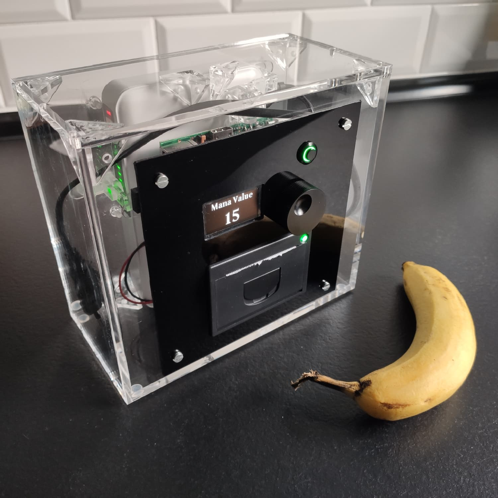
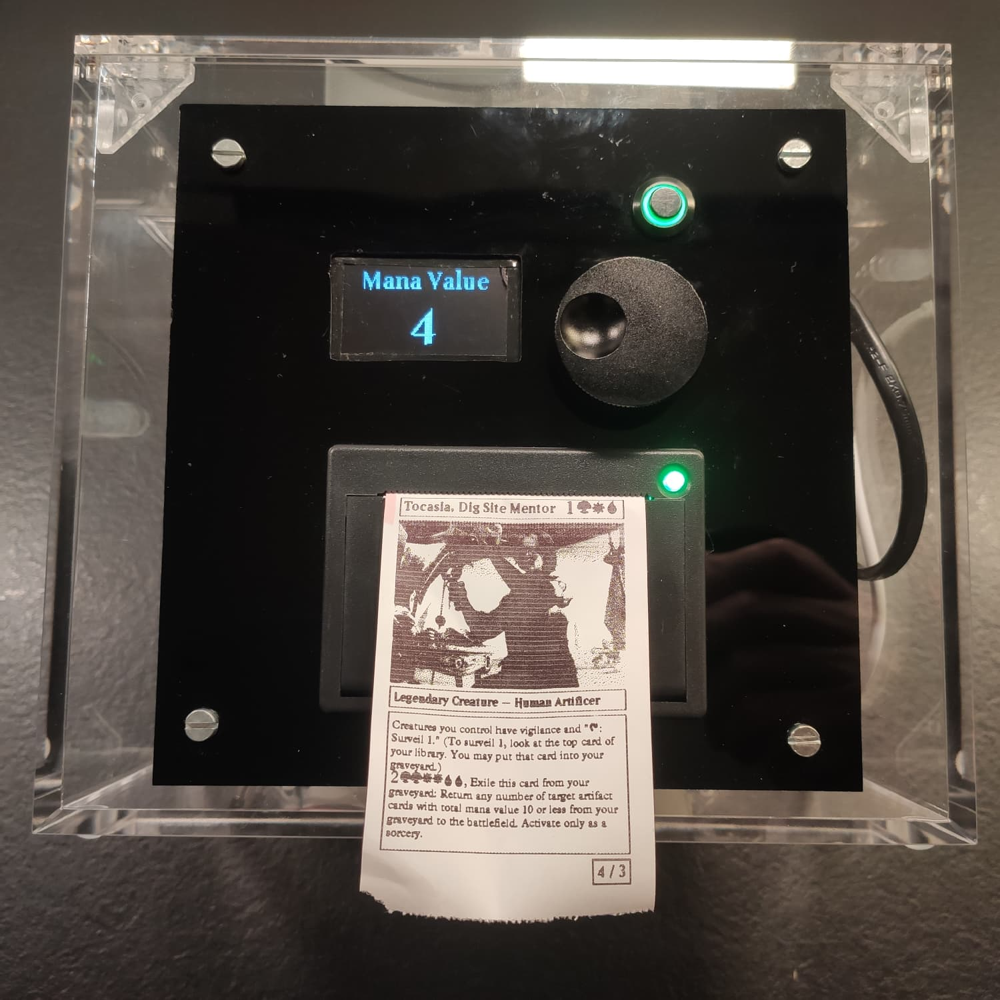
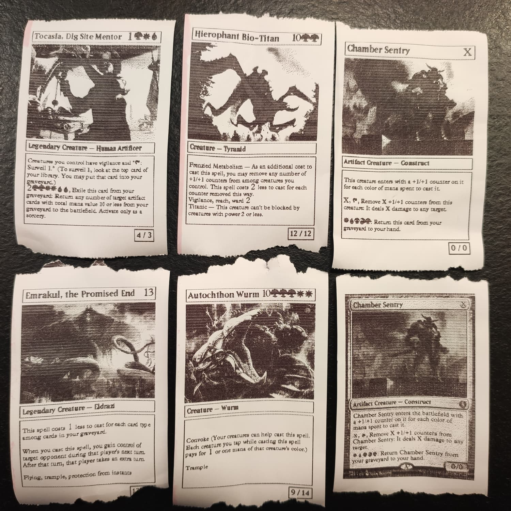
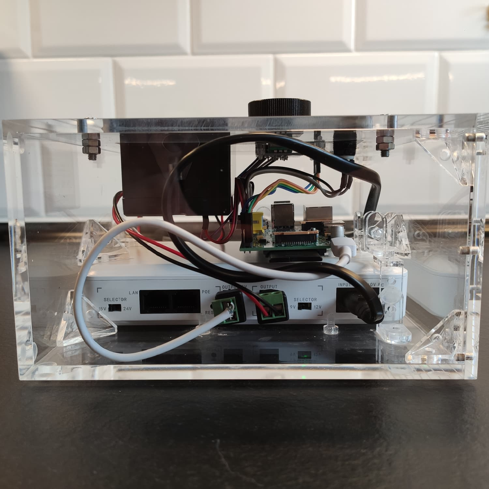
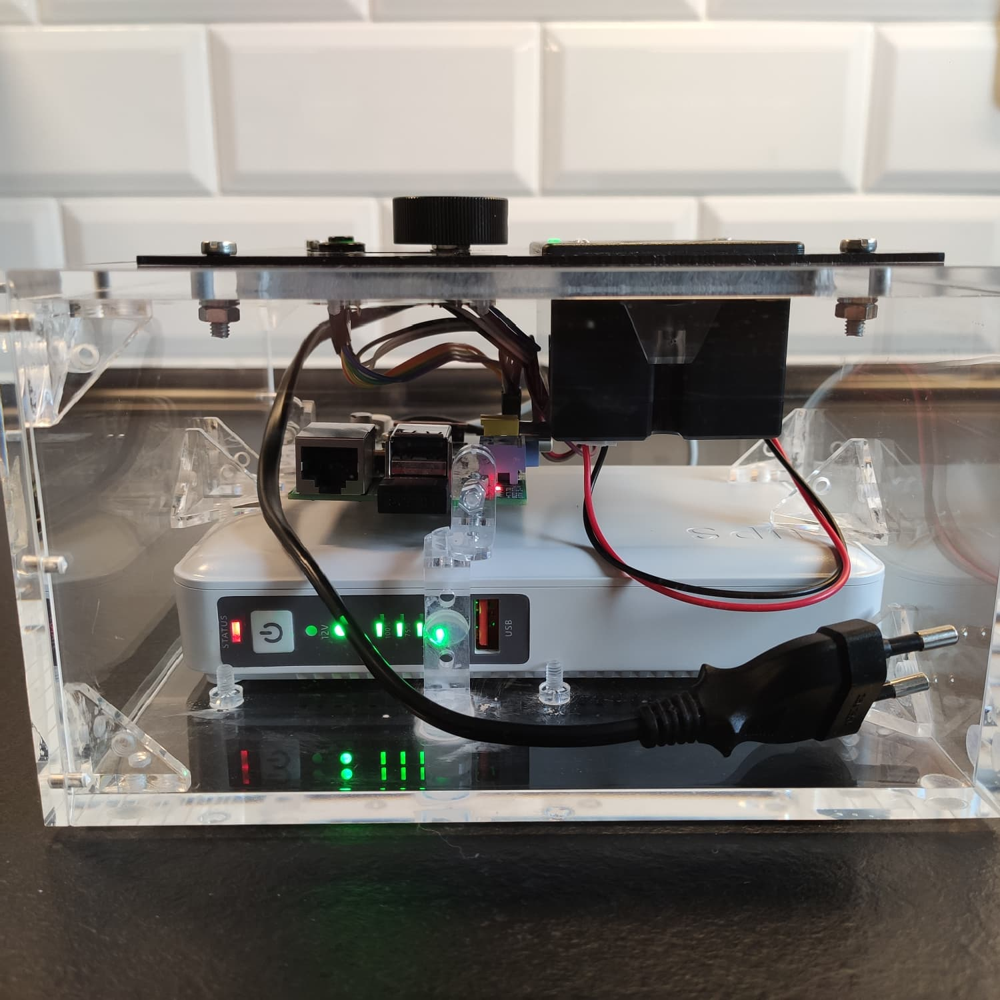
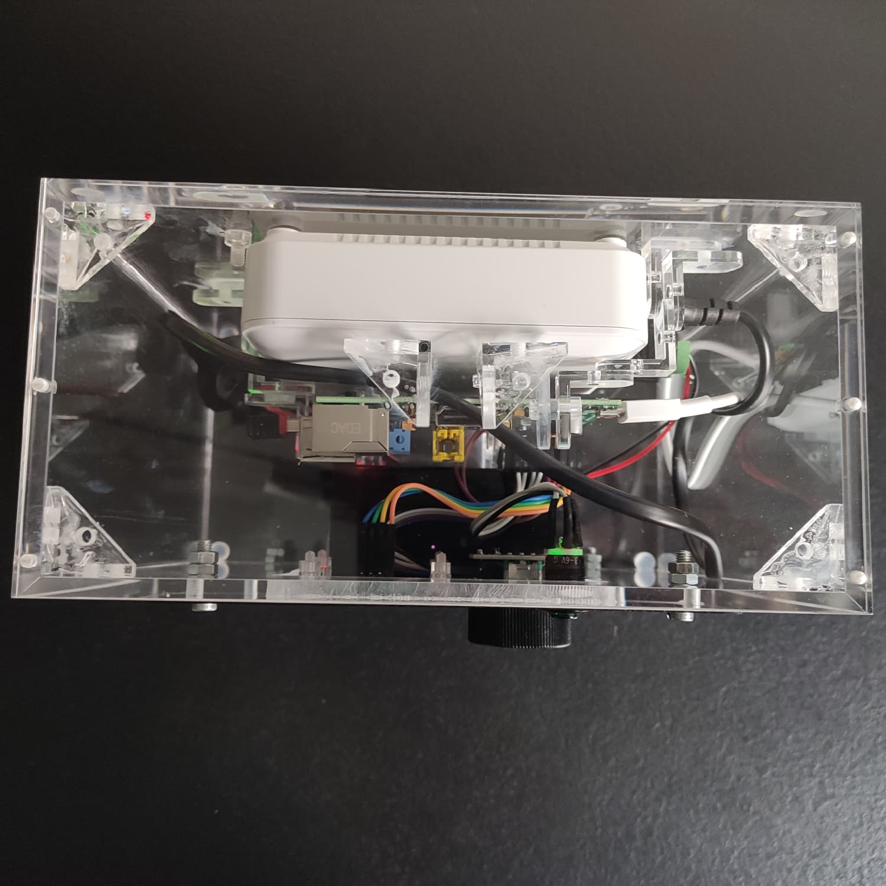
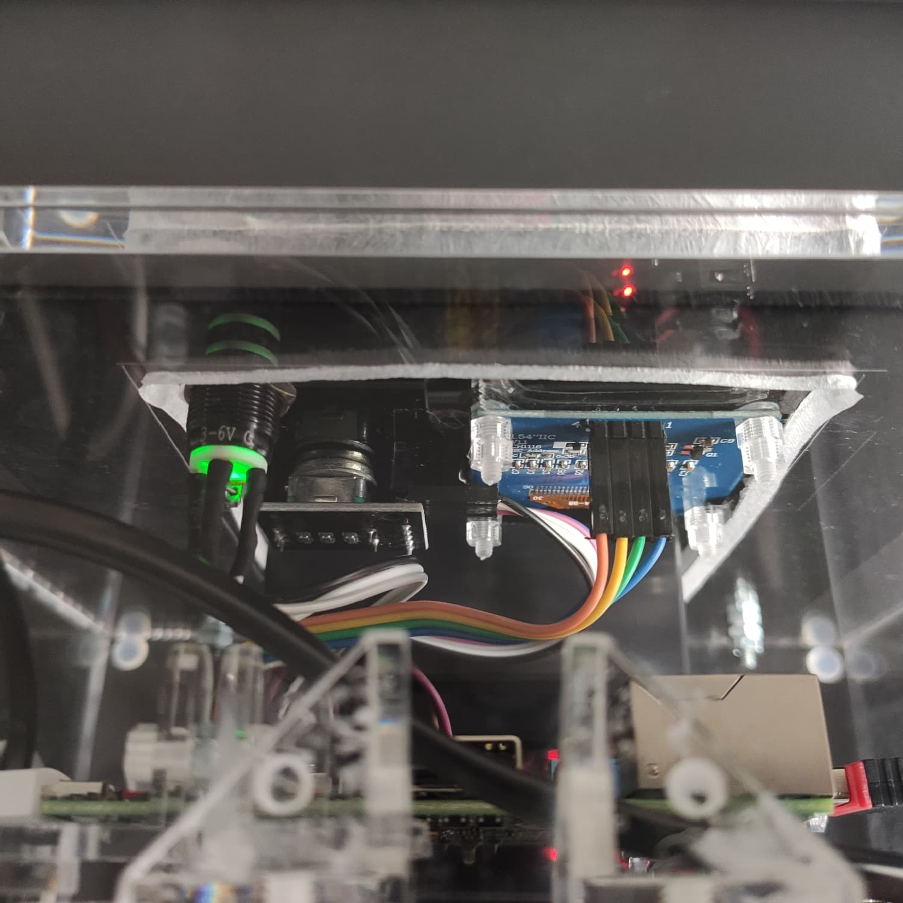
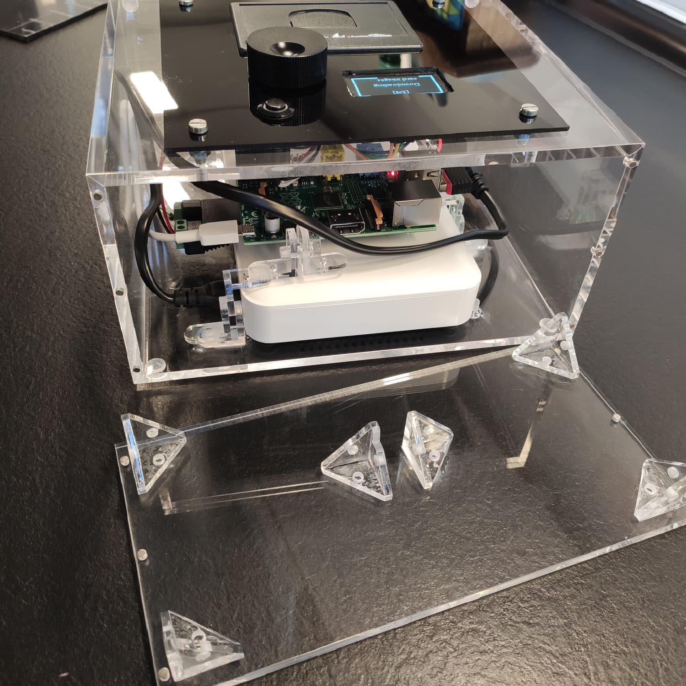
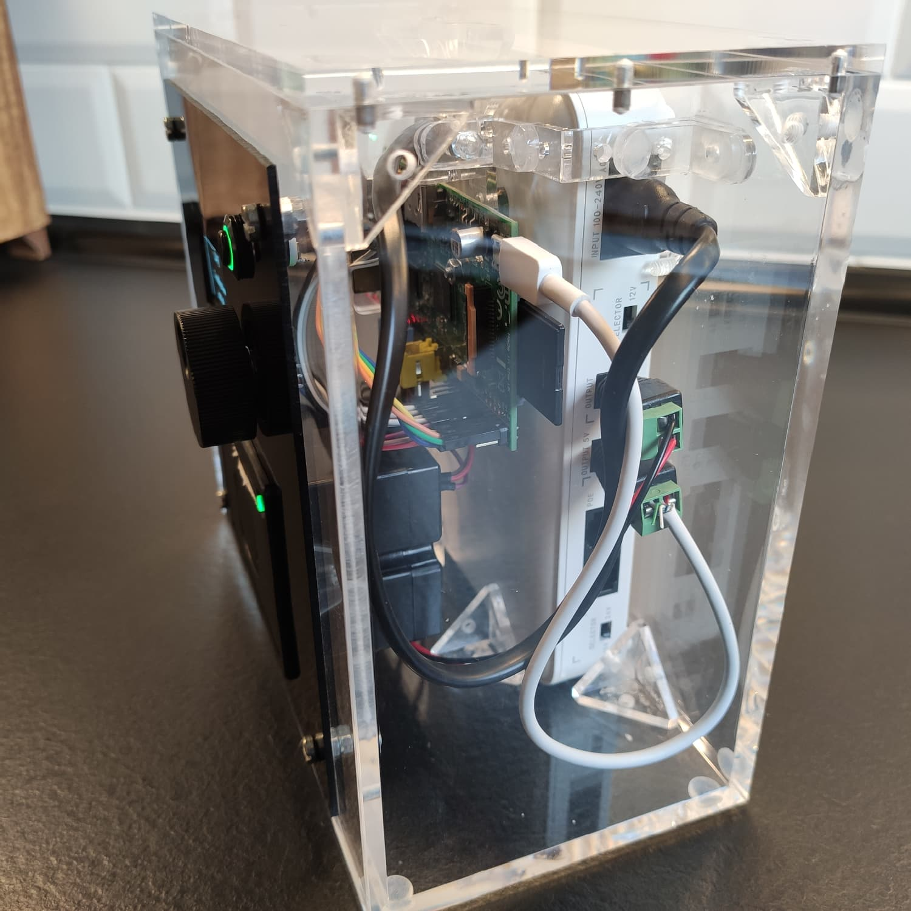

# MtG Momir Printer

Software for playing the custom **Momir (Basic)** game mode of *Magic the Gathering* with a thermal printer connected to a *Raspberry Pi* to enable playing this game mode in paper. This boils down to the user choosing a mana value and the system selecting a random creature card with the given mana value and printing that card so it can be used in paper play. The focus of this project is to offer maximum comfortability with many advanced features!

<p align="middle">
	
	
	
</p>

### Features

- Select a random creature card of a given mana value and print it
  - Contains all creatures legal in any format (e.g. mdfc backs)
- Print the Momir Vig Avatar card
- 2 printing modes: card images or custom rendered text with art image for better readability
  - Featuring the orignal fonts and common mana symbols! (Credits to WotC and [Mana font](https://github.com/andrewgioia/mana))
- Show relevant current card info on the display (also using mana symbols)
- Allows for complete offline use after initial connection
- Downloads new cards and updates all relevant data when having internet connection
- Runs on low-end devices (e.g. Raspberry Pi 1 Model B)
- Designed for convenient use with rotary button and display
- Convenient shutdown and reboot options

## Instructions for usage

If everything is set up, here is what you can do with the program:
- Turn rotary button → select a mana value
- Press rotary button → print a random creature card with the selected mana value
- Press LED button → show last printed card info on display
- Double-click rotary button → print Momir Vig Avatar
- Double-click LED button → switch to the full-image mode (reprints last card)
  - Double-click again → switch back to the text-based mode
- Long-press (2s) LED button → shut down system
- Long-press (2s) rotary button → restart the program

See "program flow" section on additional commands and initialization skipping.

## Setup

Setup consists of the hardware used and the software running on it. I configured and tested everything only on my specific hardware setup which is listed below. You can customize it if your setup is different (see "custom considerations" section).

### Hardware Requirements & Setup

List of relevant hardware parts used (for reference):
- Raspberry Pi 1 Model B (with storage medium for OS and data)
- Thermal Printer QR204 58mm
- OLED Display CH1116 1,54" 4 pin monochrome (128x64) (marketed as SH1106)
- Rotary Encoder KY-040
- Push Button with LED (self-reset) (mine is 4-pin, but others should work as well)
- 9V power source (delivering 2A) for printer and 5V power source for everything else (I use a UPS with both outputs)
- optional: WiFi adapter for connectivity (otherwise Ethernet-cable)

For convenience, I recommend using an actual SH1106 display, a more capable Raspberry Pi model, and a WiFi adapter you know will work with the RPi.

Connect everything as shown in the wiring diagram. You can use a different pin setup, but the printer must be connected to the UART pins and the display to the I2C pins. 
My LED button has four outputs with two of these being ground for the button and LED, respectively; it's okay if your button only has three pins.


Many choices including the OS depended on the very limited hardware. Flash [DietPi](https://dietpi.com/) on your storage medium and start the RPi. Make sure you have internet access on the device until after you have successfully started the main program at least once. If your hardware is better, a more sophisticated OS is probably easier to set up.

<details>
<summary>(Optional: Setting up WiFi)</summary>

Prerequisites depend on the dongle you have. I have a cheap one and fortunately I did not have to install any drivers manually. There are ones that specifically state that they work on Raspberry Pi.

- see if net adapter (wlan0) available: ip link show
	- see if device available: lsusb
- show networks: iw wlan0 scan | grep SSID:
- edit /etc/wpa_supplicant.conf add network={ ssid="" psk="" }
	- multiple networks below each other, higher networks have priority
	- add network per command:  wpa_passphrase {name} {pw} >> /etc/wpa_supplicant/wpa_supplicant.conf
	- set update_config=1 option to 0 so list isn't automatically cleared
- connect with: wpa_supplicant -B -i wlan0 -c /etc/wpa_supplicant/wpa_supplicant.conf 
- get ip: dhclient wlan0
- see connected network: iw dev wlan0 link | grep SSID:
- if problems check network config in /var/network/interfaces
- disable usb powersave/autosuspend: echo -1 > /sys/module/usbcore/parameters/autosuspend    (value is 2 by default)
	- needs to repeated every startup so write service to set value: 
		- create service file disable-WiFi-powersave.service:
		  ```
		  [Unit]
		  Description=Disable WiFi Powersave

		  [Service]
		  Type=oneshot
		  ExecStart=echo -1 > /sys/module/usbcore/parameters/autosuspend

		  [Install]
		  WantedBy=multi-user.target
		  ```
		- copy file to services: cp {name}.service /etc/systemd/system/
		- start: systemctl start {service-name.service}
		- enable on startup: systemctl enable {service-name.service}

</details>

<details>
<summary>Custom considerations</summary>

Depending on the specifications of your printer and display, you need to change their configurations in the respective `printer.py` and `display.py` files. If you undervolt your printer, you might want to change the contrast and threshold on the black/white images in `process_images.py`. For me, the printer worked almost well enough on 5V even though it is below the official spec.

You can use a regular wired power supply if you don't need portability, but using a simple power bank (with voltage regulator) instead of a UPS might cause problems with supplying a stable power level because the RPi doesn't have a power buffer (battery) like the usual connected devices like phones and will crash if there are any fluctuations in delivered power.

If you use a different RPi model or OS, you might have to change to GPIO bouncetimes if you don't use LGPIO. You also might want to increase the batch sizes in the `load_scryfall_data.py` download functions if you device is more recent and you want faster speeds. You must change the GPIO pin setup accordingly if you deviate from the provided wiring diagram.

If your device has very limited storage (<8GB), you might have to change how data is stored. This program keeps all downloaded images in all versions; by only saving the color images temporary, storage can be saved. Currently, the total data stored (`data/` dir) is roughly 4GB.

</details>

### Software Installation

You must install python and probably some libraries + configuration to get the hardware running. If you want to use parts of the software on a device other than the Raspberri Pi, you can install the dependencies *excluding* the hardware-specific ones with `pip install .`. 

To access the RPi remotely (as DietPi is headless), use software like [PuTTY](https://www.chiark.greenend.org.uk/~sgtatham/putty/) (SSH client) and [WinSCP](https://winscp.net) (SFTP file browser) (*on Windows*). The [DietPi-Dashboard](https://dietpi.com/docs/software/system_stats/#dietpi-dashboard) is also convenient if you want to access and monitor your device via the browser; it can be installed from the DietPi software list.

<details>
<summary>Setup SFTP</summary>

- SFTP is not enabled on DietPi by default, so you must do that:
  - install a server, i use a lightweight one: apt install gesftpserver
  - create link: ln -s /usr/libexec/gesftpserver /usr/lib/sftp-server

</details>

<details>
<summary>Setup GPIO</summary>

- install compatible rpi.gpio version: pip install rpi-lgpio
  - always use prefix "RPI_LGPIO_REVISION=800012 python3" for starting scripts so lgpio knows rpi 1b model is used
  - add to global env permanently in: nano /etc/profile , then in file: export {name=value}
  - make available to sudo: run visudo cmd and add line with: Defaults env_keep += {var_name}
  - check is available with: printenv

</details>

<details>
<summary>Setup Printer</summary>

- active uart in dietpi-config -> advanced -> serial/uart
- install missing libraries for pillow to work (view updated package names [here](https://pillow.readthedocs.io/en/stable/installation/building-from-source.html#external-libraries)): apt install build-essential libjpeg8-dev libtiff5-dev libopenjp2-7-dev libxcb1-dev libfreetype6-dev
- install in venv: pip install python-escpos\[serial]
- check if exists: dmesg | grep tty
	- should be ttyAMA0 but serial0 should always point there too (see ls -l /dev)
- add user: usermod -a -G dialout {user}

</details>

<details>
<summary>Setup Display</summary>

- active i2c in dietpi-config -> advanced -> i2c
- add user: usermod -a -G i2c {user}
- view device and adress: i2cdetect -y 1
	- adress should be 3c and needs to be specifiec in python display init
- install missing libraries if missing (view updated package names [here](https://luma-oled.readthedocs.io/en/latest/software.html#installing-dependencies))
- install luma: pip install luma.oled
- my display is actually ch1116 (even though marketed as sh1106), so a workaround is needed to use sh1106 class
  - in luma.oled init file (oled>device>__init\__.py), modify sh1106 class: in there is display func, change `self.command(set_page_address, 0x02, 0x10)` to `self.command(set_page_address, 0x00, 0x10)`

</details>

<details>
<summary>Create autostart service</summary>

You can create a system service that will start the program automatically during startup. The one below is configured to start after networking is set up to allow fetching updates without problems. If the program crashes, the service restarts it.
- create service file run-mtg-program-after-startup.service (and adjust the path if yours is different):
  ```
  [Unit]
  Description=Run Mtg Printer After Startup
  After=network.target

  [Service]
  Type=simple
  Environment="RPI_LGPIO_REVISION=800012"
  ExecStart=/home/dietpi/mtgprinter/.venv/bin/python3 /home/dietpi/mtgprinter/src/main.py
  Restart=on-failure

  [Install]
  WantedBy=multi-user.target
  ```
- copy file to services: cp {name}.service /etc/systemd/system/
- start: systemctl start {service-name.service}
- enable on startup: systemctl enable {service-name.service}

</details>

### Test your setup

Use the provided `check_hardware.py` script on your device to quickly and comfortably verify that your hardware and software is set up correctly. The script gives you button input feedback on both the display and in the terminal. Pressing the rotary button also prints a test image.

## Start the program

After everything is set up, clone/copy this code and run `pip install .[raspi]` on the device. You can then run this program via `python3 main.py`. If everything works, you can set up a system service to run the program automatically after every system boot (see above).

If you want to skip card data updating, add the `-s` flag. Note that the program must be started without this flag at least once to initially download all the available card data and images.

You can also specify which card images you want to download if you are only interested in one of the two available print modes. Use the `-t` flag with the argument `border_crop` if you only want the full image mode or use the argument `art_crop` if you only want the more readable custom-rendered mode.

### Downloading & processing data in advance (recommended)

Especially if your hardware is rather limited, the first initialization step of downloading and processing all the card data and images can take a long time on the device (>1h). I recommend running this step on your computer (<10min) and then transferring the resulting data folder to the program directory on the device for a likely significant speedup. Use the `init_data.py` script to run this step on your computer (`python init_data.py`) without the hardware-dependent import rquirements of the *main* script. This script supports the `-t` flag just like the main script. Note that the printer device width is manually specified in this script and must be adjusted accordingly if you use a different printer type.

## Program Flow & Options

1. After start, the program first enters initialization of its components, mainly hardware
   - -> The LED starts blinking; hold button pressed (when display shows "Beginning initialization") if you want to skip the next data updating step
2. Next, the program attempts to update its data if connected to the internet. Otherwise this step is skipped.
   1. If a newer bulk data version is available, the bulk data for all cards is downloaded
   2. Next, this data is loaded into the DB
   3. Then, the images for all cards are downloaded (for each print mode)
   4. Finally, the images are processed for printing and the new versions are saved (for each print mode)
   - -> If updating fails, the program restarts to try again; hold button pressed (when display shows "Initialization failed") to instead stop the program and shut the system down 
3. The program enters the main loop where the user can interact with it (the LED is now permanently on to signal the program is ready). See instructions above
4. If shutdown is requested, the program is gracefully stopped and the system shuts down. If restart is requested, the program restarts instead, starting from step 1

If an error is encountered at any step and the program cannot resolve it, it restarts itself, but not the system. Step 2 is skipped during such program restarts. If the program is stuck in a faulty state and restarts in a loop, the LED button can be held pressed during the announcement on the display to cancel it and shut the system down instead. The same can be done if an error is encountered during the main loop to prevent the system from rebooting.

## Outlook

### Update to future versions of the game

Magic is a permanently evolving game, introducing new mechanics and card types which may require adapting this software. Below is a list of aspects that could potentially require adjustments: 
- queries.py: new card layouts with multiple faces (beyond transform, modal_dfc, prepare, etc.) have to be added to the constants and new categories might need to be handled in get_random_creature_card() and get_standardized_card_dict()
- load_scryfall_data.py: the ALLOWED_CARDS list and the legal card filter in _is_card_valid() if more or less cards should be indexed
  - all other constants and dict keys are based on the Scryfall API spec, but these are unlikely to change

### Additional features

<details>
<summary>Potentially upcoming features</summary>

Features that I might add at some point in the future (although unlikely):
- Option to only cache original images without permanently storing them
- Show printed card history on display
- Add proper logging
- Two download/processing modes for fast and slow devices
- Skip downloading data for unreachable creature cards

</details>

## Physical build notes

This section is about my experiences with building the physical machine. Your experience will probably differ, but I hope to give some rough insights into the used resources, how-to, and minimum required tools. Below are some more pictures showing details of the result. 

<details>
<summary>Detail images</summary>

<p align="middle">
	
	
</p>

<p align="middle">
	
	
</p>

<p align="middle">
	
	
</p>

</details>

### Electronic parts & materials used

Below is a list of all parts used in this project. I bought most of the parts on AliExpress.

| Part                                     | Price     |
| :--------------------------------------- | ---------:|
| Raspberry Pi 1 Model B 512MB[^1]         | ~15€      |
| SD card 8GB[^1]                          | ~4€       |
| Thermal printer                          | 20€       |
| Display                                  | 5€        |
| Rotary encoder                           | 3€        |
| Rotary encoder cap                       | 4€        |
| LED button                               | 2€        |
| Wires (10cm, 40pcs)                      | 3€        |
| UPS (8000mAh, 5V & 9V output)            | 28€       |
| DC power cable adapter 2,1mm (2pcs)      | 2€        |
| Micro USB cable[^1]                      | ~1€       |
| WiFi adapter                             | 2€        |
| **TOTAL ELECTRONICS**                    | **~90€**  |
| Acrylic box (20.5x18x10cm, 5mm thick)    | 24€       |
| Acrylic cover plate (15x15cm, 2mm thick) | 5€        |
| Acrylic glue (any super glue should work)| 3€        |
| Acrylic corner brackets 3-sides (10pcs)  | 4€        |
| Acrylic corner brackets 2-sides (15pcs)  | 4€        |
| (Metal) screws[^1]                       | ~1€       |
| **TOTAL MATERIALS**                      | **~40€**  |
| **TOTAL**                                | **~130€** |

[^1]: Part I had lying around, using current rough market price

The total cost is about 130€ (150$). Of course parts prices differ between sellers, but this is to give a rough estimate of the project's cost. Note that it's most likely easier to get a more recent RPi model that will probably cost you more like 20-25€.

### Assembly & required tools

#### Required tools

- Screwdrivers & pliers
- Drill & bits
- Handsaw / hacksaw, mostly just the saw blade (capable of cutting acrylic & maybe aluminium)
- Round & flat files
- (Clamps & wood (or similar soft-ish material))
- (Soldering kit)
- (Heat-shrink-tubing with heat gun (a hair dryer should work fine))

This is the bare minimum that I had available to me. If you have advanced tools or a 3D printer, everything becomes much easier and you can probably skip some of the (sub-)steps below.

#### Assembly

Below are my rough assembly steps. Note that I had limited resources and tools which made everything harder. If you have more tools / materials, please derive a better assembly plan. View the notes below for details.

1. Cut holes for components in acrylic cover plate
   - For rectangular holes: drill holes (large enough for saw blade to fit) for corners and use saw blade to cut between
   - For round holes: drill hole (can be smaller than component, but must then be widened)
   - Widen or shape the holes and edges with the files to get the final desired shape
2. Cut hole fitting all components in acrylic box (drill and cut to make rectangular hole as above)
   - Also cut screw holes before, if you want to screw on the cover plate
3. Use acrylic brackets to build support for UPS and RPi (3D printer would have been great here)
   - Glue them together in a way that makes sense
   - The acrylic screws for the brackets perfectly fit the screw holes on my RPi so I could directly screw it on them
4. Secure components on cover plate (most should have screw support needing no additional holes)
   - Only the display required screws. As drilling holes close to the display hole wouldve likely broken the acrylic plate, I glued acrylic screws to the backside of the plate and used these to secure the display
5. Secure wires on components & connect them to the RPi
   - You might want to or have to secure the wires on the components by soldering them and/or using heat-shrink tubing. I had to solder the wires to the LED button and use heat-shrink tubing to connect the wires to the printer (very small pins too close together to solder)
6. Place UPS in the box, then secure the RPi on top and then screw on the cover plate; finally, connect the RPi and printer to the UPS

Notes:
- Drilling and cutting the acrylic was painful and I actually destroyed my first acrylic box by using a too big drill bit. Always make sure to clamp some wood behind the acrylic you're drilling to prevent the back breaking off and try not to use drill bits with a radius of more than 5mm. Always drill with high RPM and in one go until youre completely through the acrylic to avoid the drill getting lodged in the acrylic.
- Filing the roughly drilled / cut holes into the right shape also took ages and produced lots of acrylic dust.
- If you have a way to avoid glueing many brackets together to build the support structure, do that. Glueing is annoying and dirty. The result is surprisingly robust though.
- My build had a focus on allowing for potential disassemly, meaning I only glued the parts that never had to be removed. The UPS can easily be slid out the removed lid of the box and used elsewhere or be replaced. The cover lid is screwed on and the RPi has additonal screw connections in the middle of the support brackets so I don't have to unscrew the screws on the ICB itself. All components can be unscrewed from the cover plate. Every cable or wire can be unplugged on at least one side.
